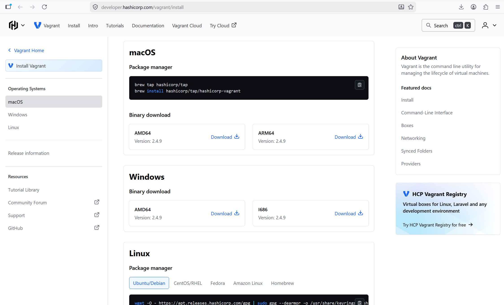
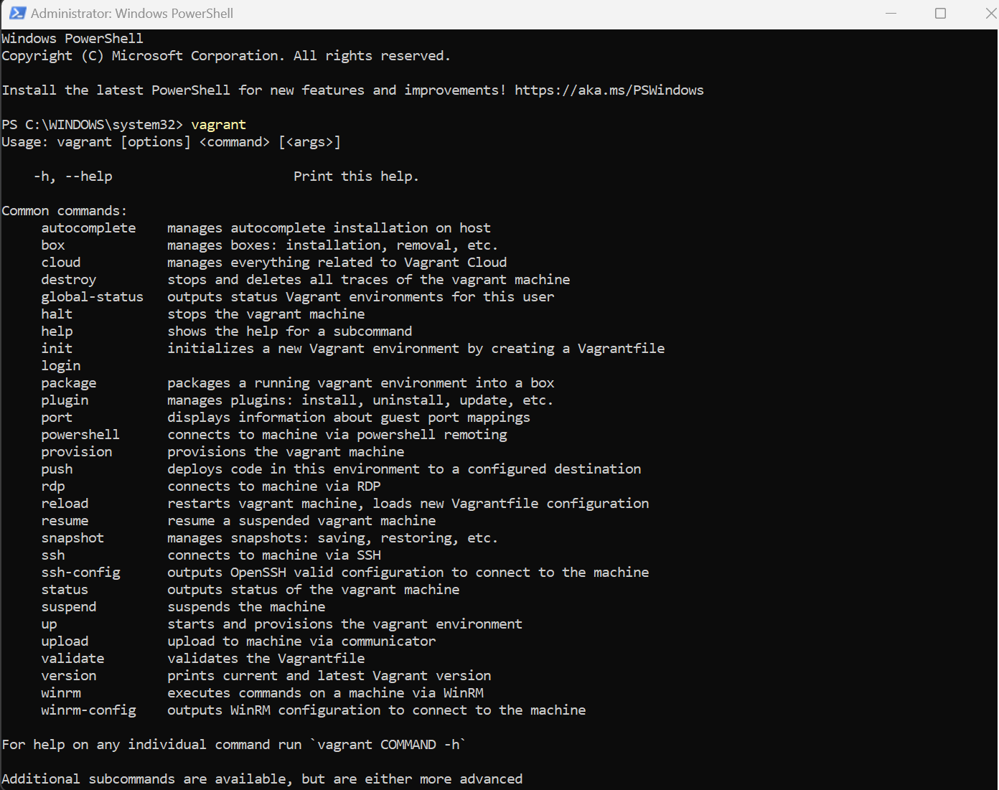
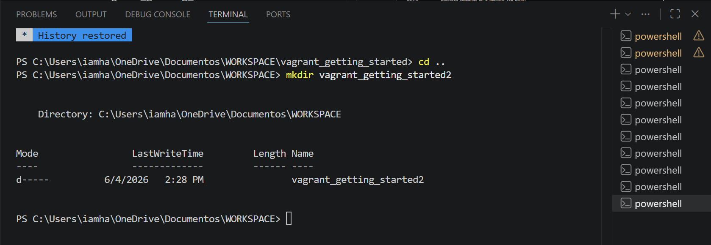
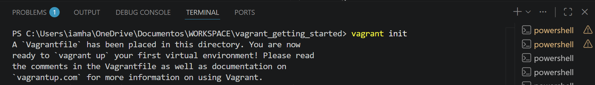
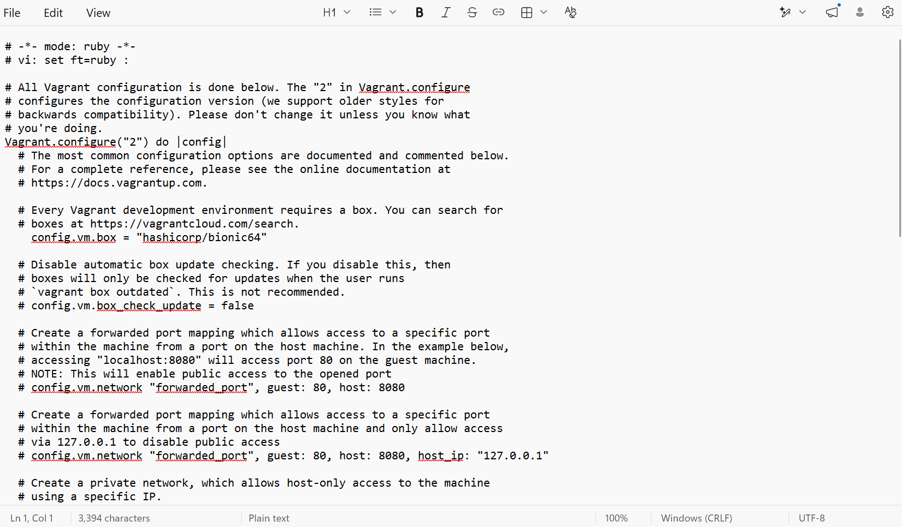
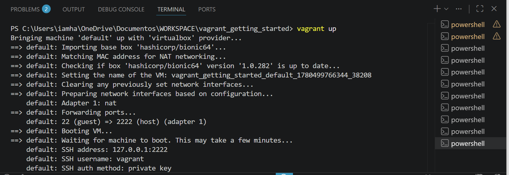
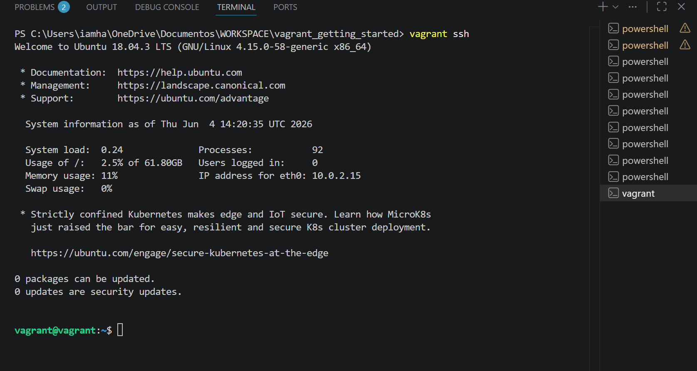
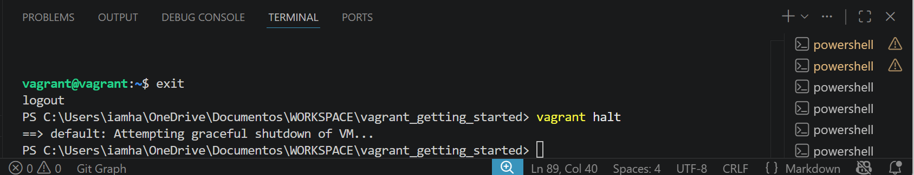
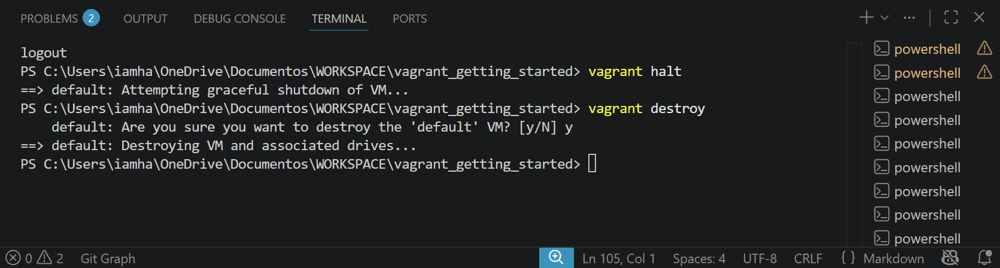

# Lab Guide for Vagrant Installation

## Installation

To install Vagrant, I will download vagrant from vagrant official website, click on the operating system for me

[Download link](https://developer.hashicorp.com/vagrant/install)

After downloading, the file will be run to get it installed.

## Installation Verification

After successfully installion, i will run command prompt on my  command terminal to verify vagrant is successfully installed.

~~~vagrant
vagrant
~~~

This shows vagrant is present and installed Successfully.

## Create a Directory for Your Project

I will create a new folder to run everything partaining vagrant projects. The folder name will be vagrant_getting_started

~~~vagrant
mkdir vagrant_getting_started
~~~

## Initialize the Vagrant Project

To get started with project, first i will have to initialize the vagrant file in my folder so that it can create a vagrant file for me with configurating setup

~~~vagrant
Vagrant init
~~~

## Configure Your Vagrantfile

After vagrant file is downloaded with configuration setup, i have to open the file with notepad and configure my base box to allow my vagrant start working.

To configure my base box, i will open the vagrant configuration file, and modify it to specify the basebox to use.

~~~vagrant
config.vm.box = "hashicorp/bionic64"
~~~

This allow vagrant to use hashicorp basebox for my projects.

## Start Your Virtual Machine

Before starting my machine, i will make sure my vagrant file is configured and my oracle virtual box is running

To start up, run command

~~~vagrant
Vagrant Up
~~~

Once my oracle virtual machine is up and running, i can access it directly by doing Vagrant SSH, which makes me interact dircectly with the machine

~~~vagrant
Vagrant SSH
~~~

## Stopping and Destroying the Virtual Machine

After Vagrant SSH, i will exit from the SSH to be able to stop/halt my machine from running or destroy it to delete or logoff the machine completely.

To stop my machine from running

~~~vagrant
vagrant halt
~~~

This will stop my machine from working.

To completely remove the machine from running

~~~vagrant
Vagrant destroy
~~~

It will ask if i'm sure i want to proceed with the delete with Y/N.

Then i will answer Y to continue with the destroy.

This will delete or remove the machine completely

